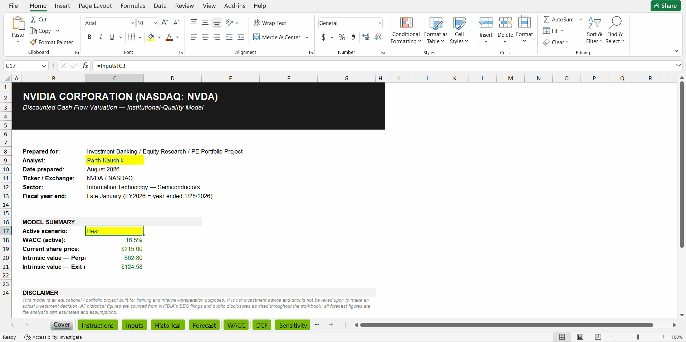

# NVIDIA (NVDA) DCF Valuation Model

**By Parth Kaushik**

An institutional-quality discounted cash flow valuation of NVIDIA Corporation, built end-to-end: research, five-year financial statement analysis, forecast model, WACC derivation, DCF, sensitivity analysis, and a fully-linked, formula-driven Excel model with a dynamic Bear/Base/Bull scenario toggle.

**Ticker:** NASDAQ: NVDA &nbsp;|&nbsp; **As of:** August 2026 &nbsp;|&nbsp; **Base case output:** $101 (Perpetuity Growth) / $207 (Exit Multiple) vs. ~$215 current price

---

## Demo: The Scenario Toggle in Action

The model's centerpiece is a single dropdown (`Inputs!C3`) that switches the entire five-year forecast, WACC, and DCF between Bear / Base / Bull cases — no manual re-entry anywhere.

<!-- Add a screen-recording GIF here, e.g.: -->

| Scenario | Perpetuity Method | Exit Multiple Method |
|---|---|---|
| Bear | $63 | $125 |
| **Base** | **$101** | **$207** |
| Bull | $163 | $339 |

<!-- Optional: add static screenshots of the Dashboard and Sensitivity tabs, e.g.: -->
<!--  -->
<!--  -->

---

## Why This Project

Most student DCF projects stop at "here's a spreadsheet with a number in it." This one is built the way a first-year IB/ER analyst would actually be expected to build it: every assumption is sourced or explicitly justified, every formula is traceable, the model recalculates cleanly with zero errors, and the valuation is presented as a *range* driven by explicit, quantified sensitivities — not a single false-precision price target.

## Key Findings

- **The two DCF terminal value methods diverge sharply**: Perpetuity Growth implies ~$101/share (≈53% downside from current price); Exit Multiple implies ~$207/share (≈4% downside). This ~2x spread is the central finding of the analysis, not a modeling error — it reflects how much of NVIDIA's enterprise value (70%+) sits in the terminal year under either method.
- **Revenue growth, not gross margin, is the dominant valuation lever.** A ±4pt/year swing in the revenue growth path moves the implied price by ~$25–30/share; a ±2pt swing in gross margin moves it by only ~$5–7/share.
- **Full scenario range: $125 (Bear) – $207 (Base) – $339 (Bull)** per share, reflecting genuinely different but defensible views on AI infrastructure capex durability, competitive erosion, and discount rate.

## Repository Contents

| File | Description |
|---|---|
| `NVDA_DCF_Valuation_Model.xlsx` | 10-tab Excel model — Cover, Instructions, Inputs (scenario toggle), Historical, Forecast, WACC, DCF, Sensitivity, Dashboard, Charts |
| `NVDA_Investment_Presentation.pptx` | 12-slide investment committee-style deck: thesis, financials, DCF, sensitivity, scenarios, risks, recommendation |
| `README.md` | This file |
| `assets/` | *(optional)* Screenshots and the scenario-toggle demo GIF referenced above |

## Quick Start

1. Download `NVDA_DCF_Valuation_Model.xlsx` and open it in Excel (best fidelity) or Google Sheets/LibreOffice (formulas and formatting are standard, no macros required).
2. Read the **Instructions** tab first — tab-by-tab guide and color legend (blue = input, black = formula, green = cross-sheet link).
3. Go to **Inputs!C3** and flip Bear / Base / Bull to watch the model recalculate live.

## Methodology

**1. Research & Industry Analysis** — Business segment breakdown, revenue drivers, competitive landscape (AMD, custom ASICs, Chinese domestic silicon), regulatory risk (export controls), and a bull/bear investment thesis.

**2. Five-Year Financial Statement Analysis (FY2022–FY2026)** — Revenue, margin, and profitability trends sourced directly from NVIDIA's GAAP earnings releases, with explicit discussion of the FY2023 "air pocket" year and the FY2026 one-time H20 export-control charge.

**3. Five-Year Forecast (FY2027–FY2031)** — Bottom-up revenue build anchored to the two most recent actual/guided quarters, with a decelerating growth curve (+82% → +12%), margin glide path, ramping effective tax rate (Pillar Two phase-in), and working-capital intensity tapering as the AI infrastructure buildout matures.

**4. WACC** — Full CAPM derivation: risk-free rate (10-yr UST), Damodaran implied equity risk premium, observed beta, and a cost of debt anchored to NVIDIA's actual June 2026 bond issuance spread (UST+65bps, Aa1/AA- rated) — not a generic assumption.

**5. DCF** — Both Perpetuity Growth and Exit Multiple terminal value methods, explicitly reconciled rather than averaged into a single false-precision number.

**6. Sensitivity & Scenario Analysis** — Two-way data tables (WACC × terminal growth; WACC × exit multiple) plus a fully dynamic scenario toggle in the Excel model that reruns the entire five-year forecast and DCF on demand.

## Known Limitations

- CapEx and NWC assumptions are simplified to a scenario-level annual schedule rather than a full 3-statement balance sheet build.
- Discounting uses year-end convention rather than mid-year convention.
- Built for educational / portfolio purposes — not a substitute for a live Bloomberg/CapIQ terminal feed, and not investment advice.

## Disclaimer

This project is for educational and interview-preparation purposes only. It does not constitute investment advice. All historical figures are sourced from NVIDIA's public SEC filings and earnings releases as cited in the workbook; all forward-looking figures are the author's own estimates.

---
*Parth Kaushik*
